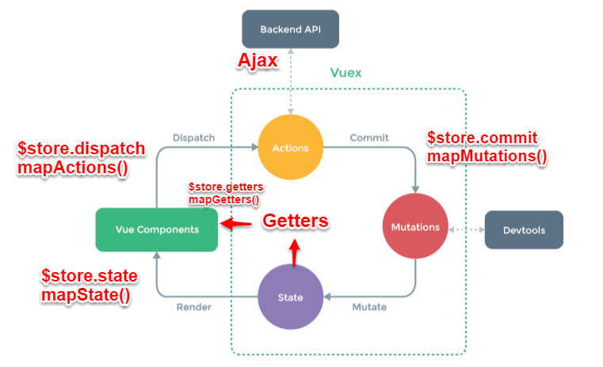

### Vuex

1. 何为数据状态管理？

> 在大型的网页应用中，多个组件之间需要共享一些状态，比如用户的个人信息，UI的展示状态等等，就可以使用 Vuex 的 store 的概念来存储一些共有的 state，实现共享数据的状态管理。

2. Vuex的五大属性

* state => 基本数据
* getters => 基本数据派生的数据（state的计算属性）
* mutations => 提交更改数据的方法，同步
* actions => 类似装饰器，包裹mutations，使之可以异步
* modules => 模块化Vuex

3. Vuex的优点和缺点

  优点：
  1. 解决了非父子组件之间的通信
  2. 减少了AJAX请求的次数，有些情况可以直接从内存中的state获取
  
  缺点：
  1. 刷新浏览器后，vuex中的state会重新变为初始状态（解决方案：`vuex-along`，`vuex-persistedstate`）
  2. 成本高，若不是大型单页应用，使用Vuex可能是繁杂冗余的。

4. Vuex的数据流
> 组件中触发 Action(dispatch)，Action 提交 Mutation(commit) ，Mutation 修改 state。组件中根据 state 或 getters 渲染页面

